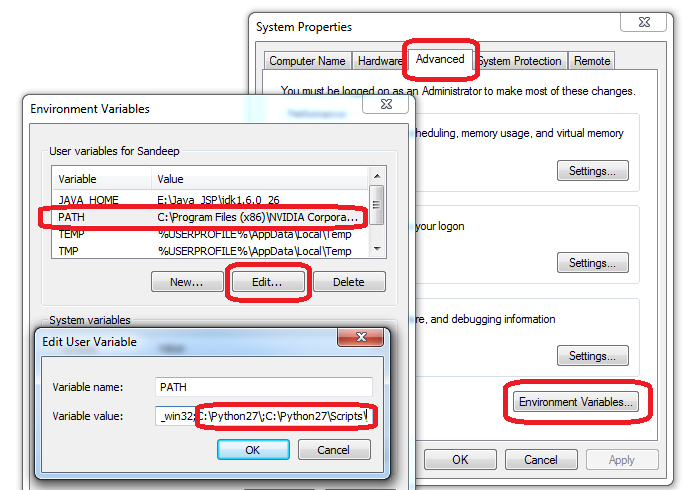

## Exercise 1.3 - Setup for Windows

The gist of this exercise is to check the dependencies by executing these commands. If all result in some version number, you are ready for this workshop. Otherwise, jump to the first section below:

```bash
C:\> python --version
C:\> pip --version
C:\> virtualenv --version
C:\> git --version
```


### A. Python 2.7 or 3.4

#### 1. Check if Python is installed or accessible. Open the Command Prompt:

```bash
C:\> python --version
```

#### 2. If this is what you see, then it means you have no Python installed. 

```bash
'python' is not recognized as an internal or external command, operable program or batch file.
```

#### 3. Download and install the latest Python 2.x or 3.x releases from this location. 

```bash
https://www.python.org/downloads/windows/
```

#### 4. Add the Python path to the system environment variables. To do this, go to `My Computer` > `Properties` > `Advanced System Settings` > `Environment Variables` > `System Variables` > `Path` or `PYTHONPATH` (whichever will work). Click edit. Add this at the _end of the line_:

```bash
;C:\Python27;C:\Python27\Scripts
```




#### 5. Check again if Python is already accessible. Reopen the Command Prompt and execute:

```bash
C:\> python --version
```

#### 6. If all goes well, you should see

```bash
Python 2.7.x
```

### B. Pip

#### 1. Check if Pip is installed. Open the Command prompt and execute:

```bash
C:\> pip --version
```

#### 2. If this is what you see, then you don’t have Pip installed:

```bash		
'pip' is not recognized as an internal or external command, operable program or batch file.
```

#### 3. Install Pip by downloading this script ([https://bootstrap.pypa.io/get-pip.py](https://bootstrap.pypa.io/get-pip.py)) and executing this line in the Terminal:

```bash		
C:\> python get-pip.py
```

#### 4. Check again if Pip is installed. Open the Terminal and execute:

```bash		
C:\> pip --version
```

#### 5. If all goes well, you should see:

```bash
pip 1.5.x
```


### C. VirtualEnv

#### 1. Install VirtualEnv. Open the Command Prompt and execute:

```bash
C:\> pip install virtualenv
```

#### 2. Check if VirtualEnv is already installed. Reopen the Command Prompt and execute:

```bash
C:\> virtualenv --version
```

#### 3. If all goes well, you should see

```bash
virtualenv 1.x.x
```

### D. Git (optional)

As a developer, there's no excuse not to use Git. But if you don't have it in your machine, you don't have to worry about it. It's not really part of Django. 

Download installer here: [http://git-scm.com/download/win](http://git-scm.com/download/win)